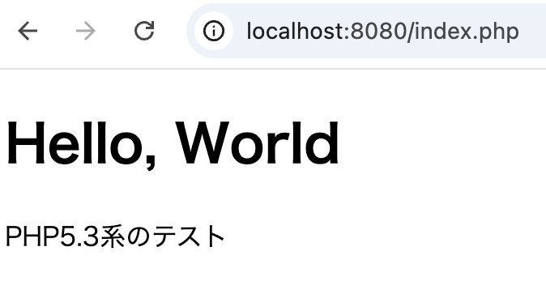

# PHP5.3系の環境構築

1. php53ディレクトリを作成
```
mkdir php53
cd php53
```

2. docker-compose.ymlを作成
先制した`php53`ディレクトリ内に、`docker-compose.yml`を作成

```yml
services:
  web:
    build: ./os/
    platform: linux/x86_64
    container_name:
      php53_web
    ports:
      - 8080:80
    volumes:
      - ./src:/var/www/html
```

3. dockerfileを作成
`php53/os`ディレクトリに`dockerfile`を作成

```dockerfile
FROM centos:6.9

RUN sed -i 's/mirror.centos.org/vault.centos.org/g' /etc/yum.repos.d/CentOS-Base.repo && \
    sed -i 's/mirrorlist/#mirrorlist/g' /etc/yum.repos.d/CentOS-Base.repo && \
    sed -i 's/#baseurl/baseurl/g' /etc/yum.repos.d/CentOS-Base.repo

RUN yum update -y
RUN yum -y install php php-devel php-mbstring php-mysql php-gd php-pdo php-pear php-process php-soap php-xml php-bcmath php-pecl-zip postgresql-devel php-pgsql
RUN yum clean all

EXPOSE 80

CMD ["/usr/sbin/httpd", "-D", "FOREGROUND"]
```

ディレクトリ構成はこんな感じ

.
├── docker-compose.yml
├── os
│   └── dockerfile
└── src
    ├── #ここにサイトデータ（index.phpとか）を置いていく

4. docker composeコマンドを実行
```sh
docker compose -f /hoge/php53/docker-compose.yml up -d
```

5. index.phpの作成
`php53/src`ディレクトリに`index.php`を作成

```php
<!DOCTYPE html>
<html lang="ja">
	<meta charset="utf-8">
	<title>PHP 5.3系のテスト</title>
	<body>
		<h1>Hello, World</h1>
		<p>
			PHP5.3系のテスト
      <?php echo phpversion(); ?>
		</p>
	</body>
</html>
```

6. ブラウザでアクセス
http://localhost:8080/index.php
にアクセスして、index.phpの内容が表示されればOK



あとは`src`ディレクトリ内でガンガンコーディングしていくのみ！

7. コンテナの停止・削除

停止
```sh
docker stop php53_web
```

削除
```sh
docker rm php53_web
```